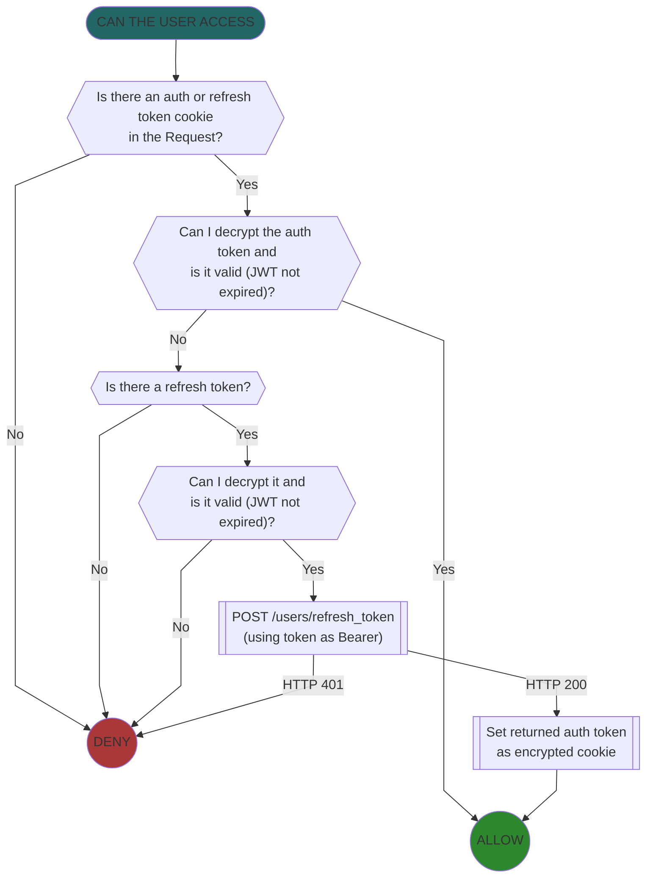

# Noct authentication plugin

Virga enables applications to check the user's authentication state before allowing access to any given route.

It does not handle logging in, only verifying that a Request is already logged in.

To add authentication to any route, import and add the `get_current_user` function as a route dependency. You also need
to supply 4 environment variables to your application at runtime to ensure it can properly parse authentication tokens.
The last 3 are identical to what they should be on the cluster with which you want users to authenticate.

- `NOCT_HOST`: the URL to which to send authentication requests. ie: <https://try.indico.io/auth>
- `ATMOSPHERE_COOKIE_SECRET`
- `ATMOSPHERE_TOKEN_SECRET`
- `ATMOSPHERE_AUTH_COOKIE_DOMAIN`

## Function

This plugin sits as a route dependency and reads, decrypts, parses, and refreshes any authentication tokens present on a Request.

Authentication depends on the presence of an auth cookie issued by IPA / Noct at login, as well as an optional refresh token used for
refreshing a user's expired session and reissue a new authentication token.

The authentication flow looks like this:

